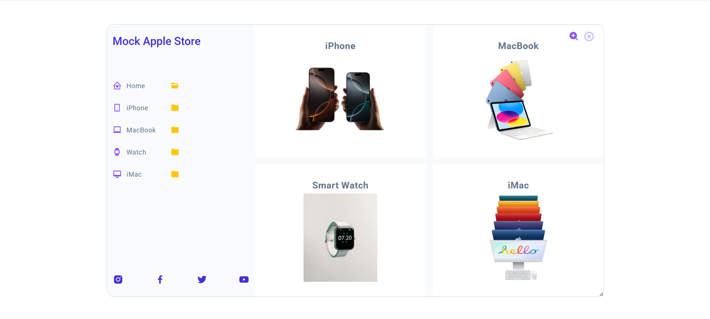
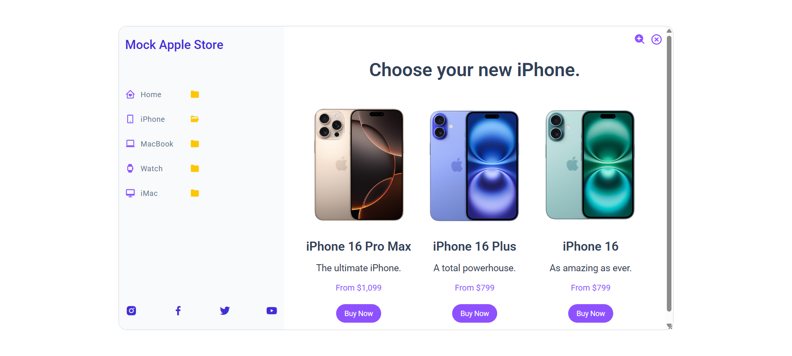
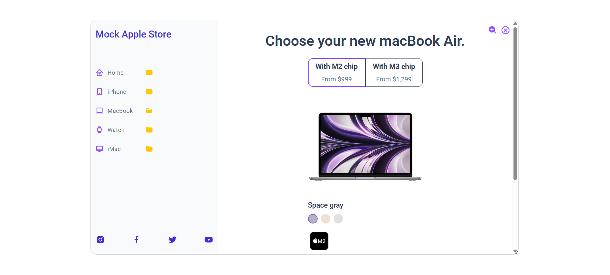
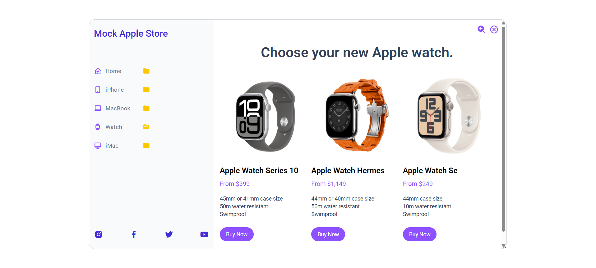
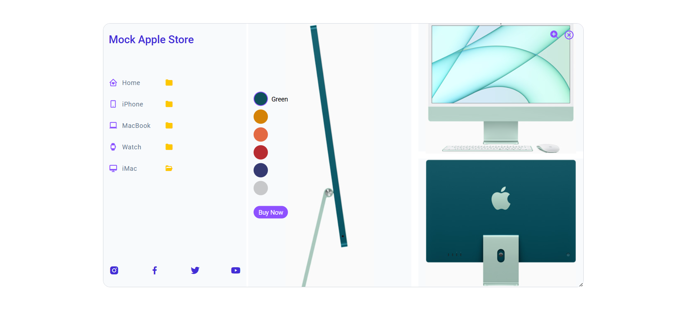
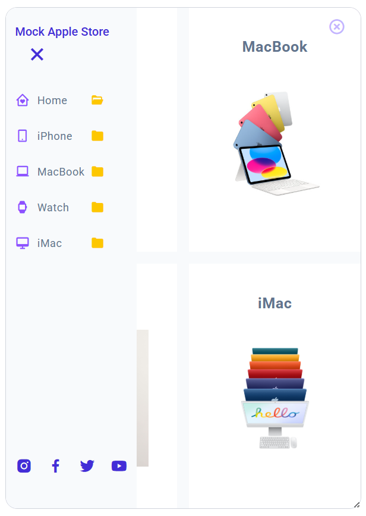

# AppleStoreWithViteReact19: 

Mock Apple Store UI

A responsive UI for a mock Apple Store, built with Vite 7 and React 19.

## Features

- **Animated Page Transitions:** Smooth transitions between pages using React hooks and TailwindCSS.
- **Responsive Design:** Works seamlessly on desktop and mobile devices.
- **Interactive Navigation:** Easily switch between Home, iPhone, MacBook, Watch, and iMac pages.
- **Dynamic Data Rendering:** Product data is managed in a single file for easy updates.
- **Modular Components:** Clean, maintainable codebase with reusable components.

## Getting Started

1. **Clone the repository:**
   ```sh
   git clone https://github.com/yourusername/AppleStoreWithViteReact19.git
   cd AppleStoreWithViteReact19
   ```

2. **Install dependencies:**
   ```sh
   npm install
   ```

3. **Run the development server:**
   ```sh
   npm run dev
   ```

4. **Build for production:**
   ```sh
   npm run build
   ```

## Technologies Used

- React 19
- Vite 7
- Tailwind CSS 4

## Credits

- Transition image: Mateus Andre on Freepik
- Watch image: Photo by Pratik Prasad on Unsplash

## Demo:  
Visit Live Site: [Click here to be taken to the web app](https://garimak1.github.io/AppleStoreWithViteReact19/)

## Screenshots







